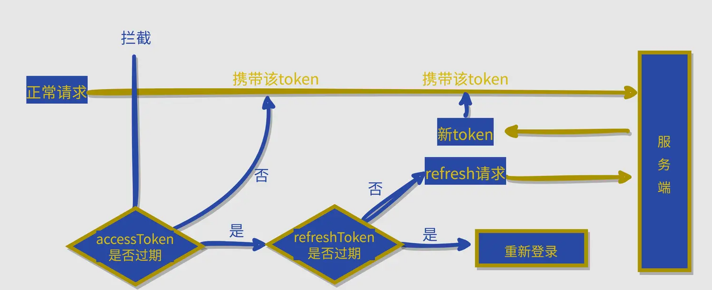

# 前端双token实现无感刷新



## 为什么要用双Token无感刷新，它解决了什么问题？

为了保证安全性，后端设置的Token不可能长期有效，过了一段时间Token就会失效。而发送网络请求的过程又是需要携带Token的，

一旦Token失效，用户就要重新登录，这样用户可能需要频繁登录，体验不好。为了解决这个问题，采取双Token（Access_Token，Refresh_Token）

无感刷新，用户完全感知不到Token的变化，但实际上，Token已经刷新了

## 这两个Token都是干什么的？具体过程是怎么样的？

### 前置条件

后端提供一个刷新Token的接口，假设是A接口。

- 两个Token的作用：
    + Access_Token：用于鉴定用户身份，即每次发送网络请求都需要携带这个Access_Token
    + Refresh_Token：用户刷新Access_Token，即调用A接口需要携带Refresh_Token，用它换得最新的Access_Token

### 过程

1、用户登录客户端之后，接收后端发送的两个Token，前端把他们存在LocalStorage或vuex中
2、Access_Token未过期时，发送网络请求携带Access_Token即可
3、Access_Token过期后，前端携带Refresh_Token调用A接口得到新的Access_Token，把新的Access_Token替换旧的Access_Token存储起来

### 具体如何实现？

首先明确一点，这个无感刷新的逻辑要写在 axios 的响应拦截器里面

- 说明
    + isRefreshing 用于标记是否正在调用 tokenRefreshAPI，相当于一把锁
    + request队列用于存储 tokenRefreshAPI 响应期间进入的 promise 对象

```js
var isRefreshing = false;
var requests = [];

// service 是自己配置的 axios，在 axios 里面配置一些基本设置，比如：baseURL, timeout, headers的Authorization（一般是 "Bearer" + Access_Token）
service.interceptors.response.use(
    res => {
        // accesstoken 超时
        if (res.data.result_status === 30002) {
            // 记录当前 res
            let response = res;
            if (!isRefreshing) {
                isRefreshing = true;
                return tokenRefreshAPI({
                    token: JSON.parse(window.localStorage.getItem('token'));
                }).then(r => {
                    // refreshToken 没过期，刷新成功
                    if (r.data.result_status === 0) {
                        // 重新设置 token
                        window.localStorage.setTtem('token', JSON.stringify(r.data.token));
                        // 执行失效的函数
                        requests.forEach(cb => cb());
                        requests = [];
                        // 因为第一个请求是没有进 requests 队列的，所以需要在这个重新发起请求
                        return service(response.config);
                    } else if (r.data.result_status === 30011) {
                        // refresh_token 过期，重新登录
                        window.localStorage.clear();
                        router.push('/login');
                    }
                }).finally(_ => {
                    isRefreshing = true;
                })；
            } else {
                console.log('token 过期，剩余请求存入队列', axiosConfig.url);
                // 返回未执行 resolve 的 Promise
                return new Promise(resolve => {
                    // 用函数形式将 resolve 存入，等待刷新后再执行
                    requests.push(() => resolve(sercice(axiosConfig)));
                });
            }
        }
        return res;
    }
)
``` 

### 注意

1、在 Access_Token 过期后，可能会短时间发送很多个网络请求，这些网络请求，在拦截器内会全部请求刷新Token，这样显然是不合理的，
其实只要刷新一次就够了，所以给刷新Token这部操作加个锁🔒，这也是为什么要设置 isRefreshing 的原因。

2、在请求刷新Token的响应时间内，可能会有多个网络请求到达，我们又暂时没有办法处理这些请求，所以我们把这些请求用 Promise 封装存储到 requests 队列中，
等刷新好 Token 之后再依次处理这些 promise 对象。
