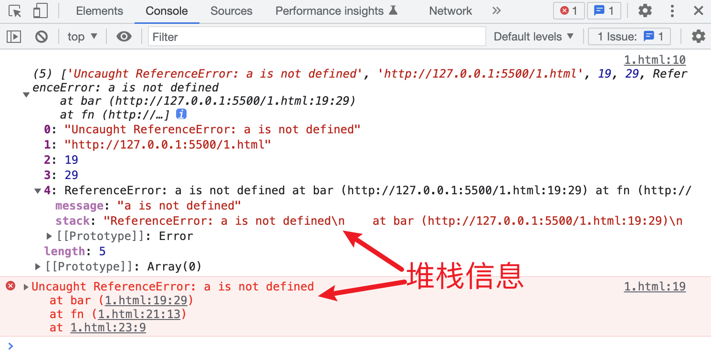
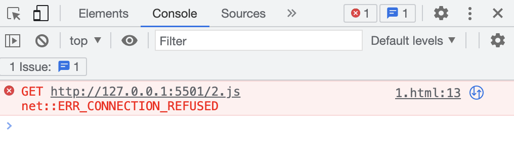
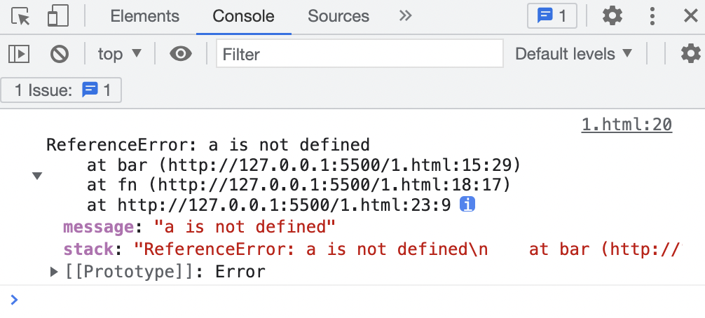
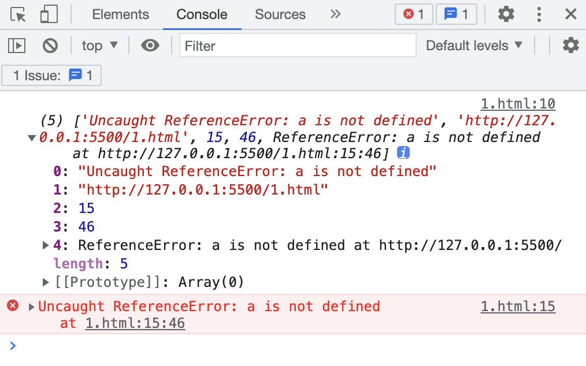
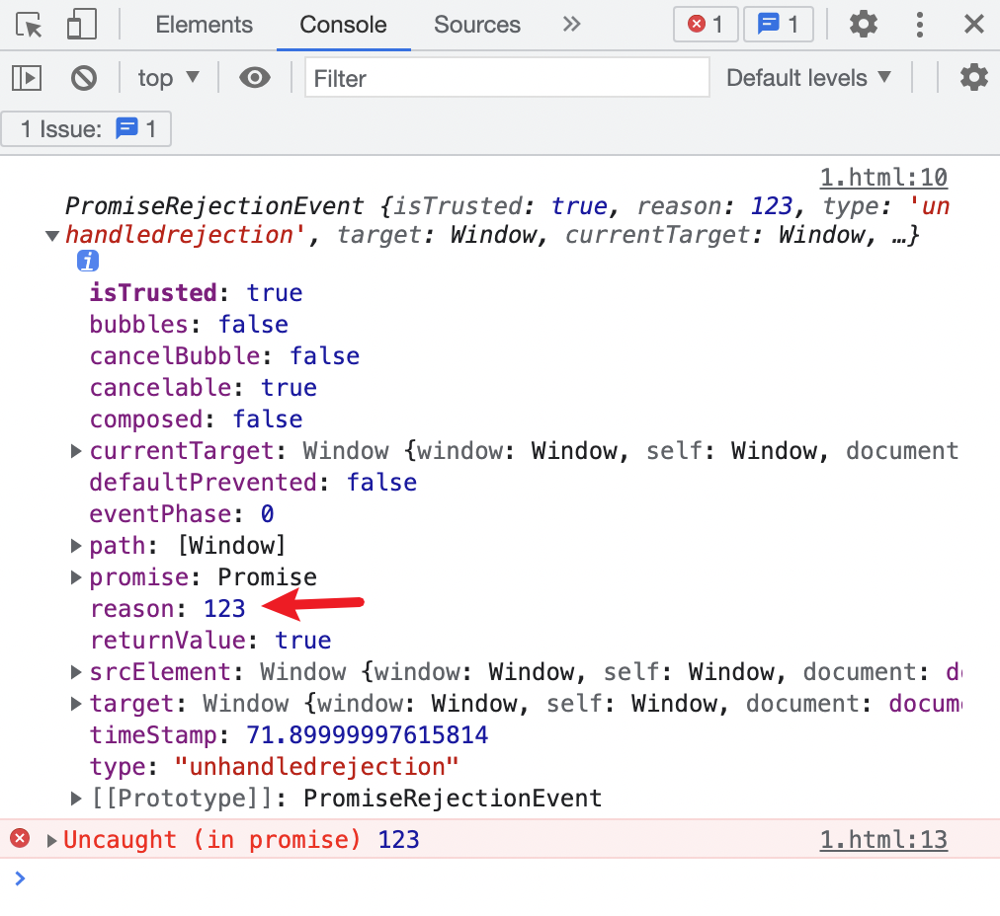
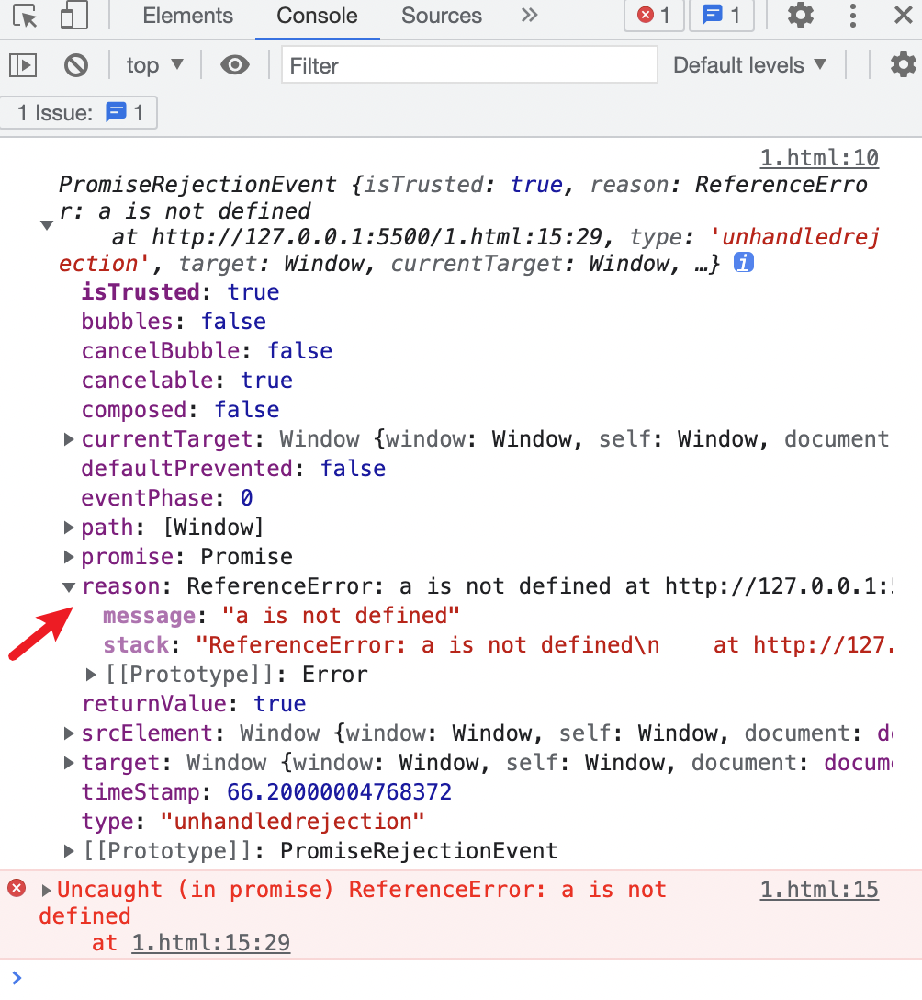
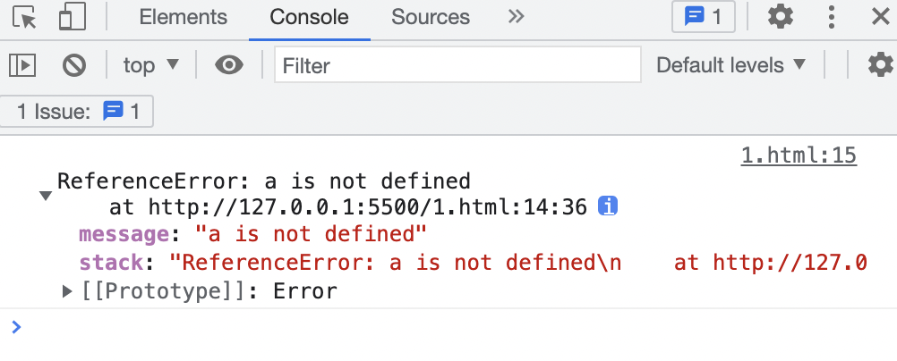
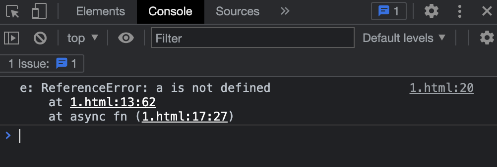
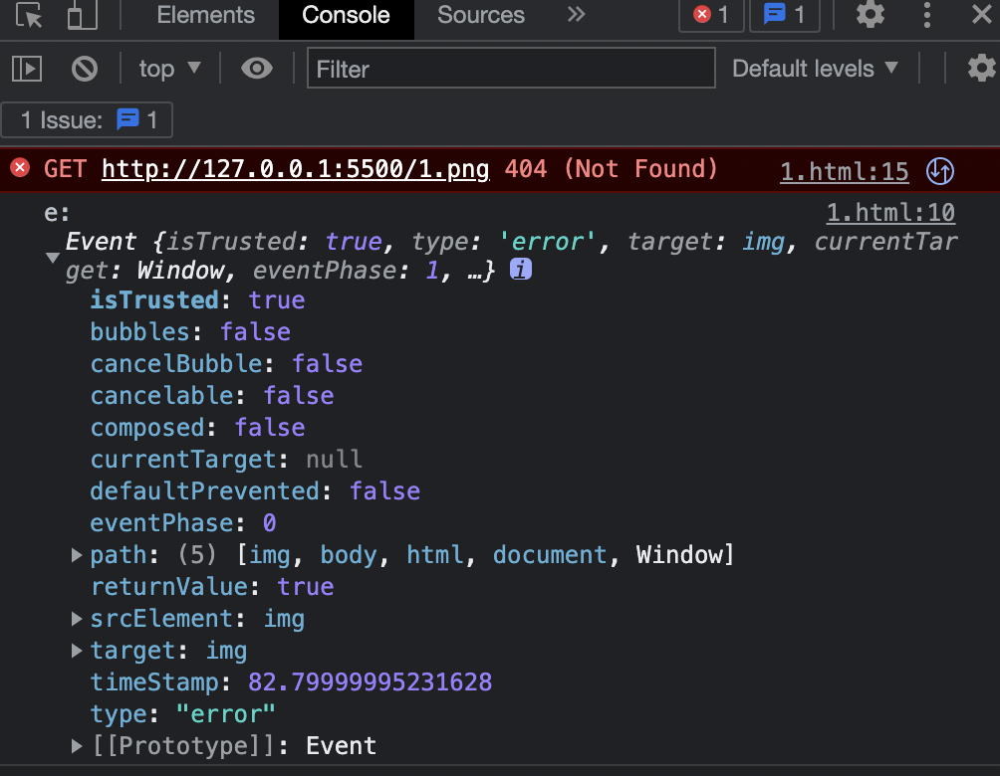
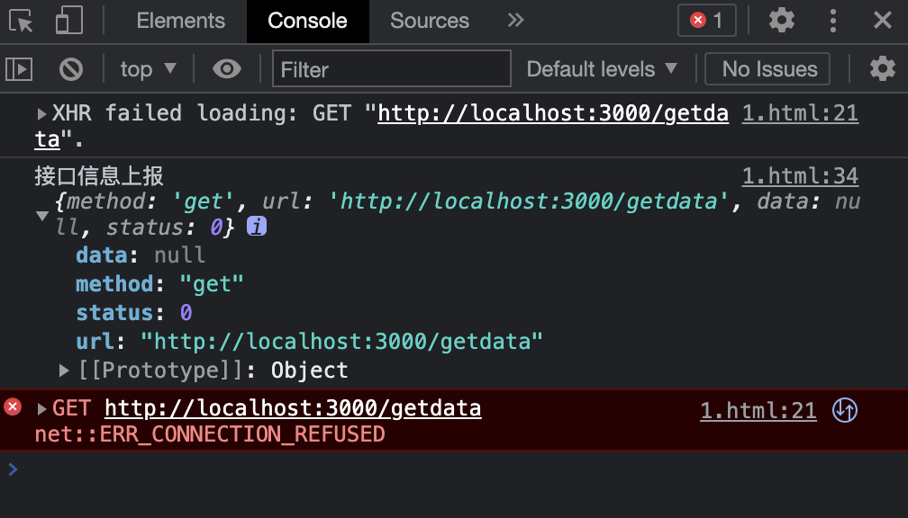

# 前端监控-错误监控原理

## 前言

我们可以看到在 前端异常通知 群里，每天都会把我们代码中的错误发出来

这对于大型前端项目来说是非常重要的，让我们能更快地知道并解决问题，而不用等到客户来反馈

但是我们是否有过好奇这是如何实现的呢？

## 分类

前端监控分为以下几类：

1. 错误监控
2. 性能监控
3. 前端埋点

我们今天主要讲的是 前端错误监控 部分

## 错误监控

### 错误类型

既然我们要去监控前端错误，那肯定首先必须要知道有哪些错误类型

1. js 代码错误
2. 资源加载错误
3. 接口请求错误

### js 代码错误

- 同步代码错误

1. 我们可以监听 `window` 的 `error` 事件来捕获全局未处理的同步代码错误
```html
<!DOCTYPE html>
<html lang="en">
<head>
    <meta charset="UTF-8">
    <meta http-equiv="X-UA-Compatible" content="IE=edge">
    <meta name="viewport" content="width=device-width, initial-scale=1.0">
    <title>Document</title>
    <script>
        window.onerror = (...e) => {
            console.log(e);
        }
    </script>
</head>
<body>
    
    <script>
        function fn() {
            function bar() {
                console.log(a.b.c);
            }
            bar();
        }
        fn();
    </script>

</body>
</html>
```


2. 跨域脚步错误
```html
<!-- 本页面所在服务 127.0.0.1:5500 -->
<!DOCTYPE html>
<html lang="en">
<head>
    <meta charset="UTF-8">
    <meta http-equiv="X-UA-Compatible" content="IE=edge">
    <meta name="viewport" content="width=device-width, initial-scale=1.0">
    <title>Document</title>
    <script>
        window.onerror = (...e) => {
            console.log(e);
        }
    </script>
    <script src="http://127.0.0.1:5501/2.js"></script>
</head>
<body>
    
</body>
</html>

<!-- 2.js -->
console.log(a.b.c);
```


此时只需要做两步操作就能捕获到跨域脚步错误

- 在 5501 端口的服务器上设置 `Access-Control-Allow-Origin` 允许跨域
- 然后在 5500 引入的脚本上加 `crossorigin` 属性

3. try-catch
```html
<!DOCTYPE html>
<html lang="en">
<head>
    <meta charset="UTF-8">
    <meta http-equiv="X-UA-Compatible" content="IE=edge">
    <meta name="viewport" content="width=device-width, initial-scale=1.0">
    <title>Document</title>
    <script>
        window.onerror = (...e) => {
            console.log(e);
        }

        function fn() {
            function bar() {
                console.log(a.b.c);
            }
            try {
                bar();
            } catch (e) {
                console.dir(e);
            }
        }
        fn();
    </script>
</head>
<body>
</body>
</html>
```


我们可以看到，try-catch 捕获的错误，就不会冒泡到全局错误捕获中

- 异步代码错误

1. 宏任务
```html
<!DOCTYPE html>
<html lang="en">
<head>
    <meta charset="UTF-8">
    <meta http-equiv="X-UA-Compatible" content="IE=edge">
    <meta name="viewport" content="width=device-width, initial-scale=1.0">
    <title>Document</title>
    <script>
        window.onerror = (...e) => {
            console.log(e);
        }

        function fn() {
            function bar() {
                setTimeout(() => console.log(a.b.c));
            }
            try {
                bar();
            } catch (e) {
                console.dir(e);
            }
        }
        fn();
    </script>
</head>
<body>
</body>
</html>
```


我们可以看到是在第十行，也就是 `window.onerror` 中捕获到的，所以 try-catch 一个函数执行，函数里面的异步宏任务出现错误，是不能被捕获到的

除非你把 try-catch 写到函数体里面进去，但是我们一般引入第三方库，是不太可能侵入别人代码的

测试 setInterval、事件处理函数 中的错误也能够被 `window.onerror` 捕获到

2. 微任务

浏览器中的微任务主要就是 `Promise`

- 使用 `window.onunhandledrejection` 来捕获未被 `catch` 的错误
```html
<!DOCTYPE html>
<html lang="en">
<head>
    <meta charset="UTF-8">
    <meta http-equiv="X-UA-Compatible" content="IE=edge">
    <meta name="viewport" content="width=device-width, initial-scale=1.0">
    <title>Document</title>
    <script>
        window.onunhandledrejection = (e) => {
            console.log(e);
        }

        Promise.reject(123);
    </script>
</head>
<body>
</body>
</html>
```


这其实并不算是错误，只是一个表示promise拒绝状态的业务上的值，也就是说这个值是我们在业务上故意人为抛出的

```html
<script>
    window.onunhandledrejection = (e) => {
        console.log(e);
        if (e.reason instanceof Error) {
            // 上报
        }
    }

    Promise.resolve(123)
        .then(() => {
            console.log(a.b.c);
        });
</script>
```

像这种才是我们应该去进行上报的错误

- 使用 `catch` 捕获 Promise 错误
```html
<script>
    window.onunhandledrejection = (e) => {
        console.log(e);
    }

    Promise.resolve(123)
        .then(r => console.log(a.b.c))
        .catch(e => console.dir(e));
</script>
```


可以看到自己写了 catch 以后，全局的 promise 错误捕获就不会触发了

- async-await 中处理
```html
<script>
    window.onunhandledrejection = (e) => {
        console.log(e);
    }

    const p = Promise.resolve(123).then(r => console.log(a.b.c));

    const fn = async () => {
        try {
            const r = await p;
            console.log(r);
        } catch (e) {
            console.log('e:', e);
        }
    }

    fn();
</script>
```


需要使用 try-catch 来捕获 promsie 拒绝状态，如果没有使用 try-catch 捕获，就会在 `window.onunhandledrejection` 事件中被捕获

### 资源加载错误

我们可以监听 `error` 事件来处理

```html
<!DOCTYPE html>
<html lang="en">
<head>
    <meta charset="UTF-8">
    <meta http-equiv="X-UA-Compatible" content="IE=edge">
    <meta name="viewport" content="width=device-width, initial-scale=1.0">
    <title>Document</title>
    <script>
        window.addEventListener('error', (e) => {
            if (e.target.src || e.target.href) {
                console.log('e:', e);
            }
        }, true);
    </script>
</head>
<body>
    
</body>
</html>
```


我们一般会监听一个单独的 `error` 事件来处理资源加载错误，其他 js 错误由另外的 `window.onerror` 来处理

所以我们这里要判断一下 `src` 或 `href` 确实是由资源加载错误触发的，才进行处理

> 注意：第三个参数要传 true，也就是捕获模式下，资源加载错误才会触发 error 事件处理函数

> 题外话：记得当初胡歌面试我的时候，就问了 addEventListener 第三个参数是什么意思，当时忘记了，因为确实一直以来没有使用的场景
> 绝大部分时候都是使用默认值 `false`，也就是 `冒泡模型` 来完成业务处理

### 接口请求错误

```html
<!DOCTYPE html>
<html lang="en">
<head>
    <meta charset="UTF-8">
    <meta http-equiv="X-UA-Compatible" content="IE=edge">
    <meta name="viewport" content="width=device-width, initial-scale=1.0">
    <title>Document</title>
    <script>
        const reportObj = {}
        
        // AOP 切面
        const oldOpen = XMLHttpRequest.prototype.open;
        const oldSend = XMLHttpRequest.prototype.send;
        XMLHttpRequest.prototype.open = function (method, url) {
            reportObj.method = method;
            reportObj.url = url;
            oldOpen.call(this, method, url);
        }
        XMLHttpRequest.prototype.send = function (data) {
            reportObj.data = data;
            oldSend.call(this, data);
        }

        // 发送 ajax 请求
        const xhr = new XMLHttpRequest();
        xhr.open('get', 'http://localhost:3000/getdata');
        xhr.send(null);
        xhr.onreadystatechange = () => {
            if (xhr.readyState !== 4) return;
            if (xhr.status === 200) {
                console.log(xhr.responseText);
            } else {
                reportObj.status = xhr.status;
                console.log('接口信息上报', reportObj);
            }
        }
    </script>
</head>
<body>
</body>
</html>
```


这里只是展示了一种获取请求信息和响应信息，然后上报给服务器的方式

一般我们工作中都会对 ajax 请求进行封装，不需要通过这种方式就可以拿到我们所需要上报的信息了
