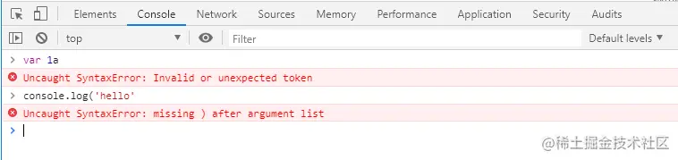
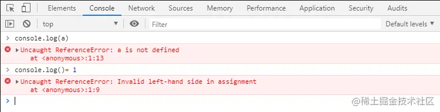
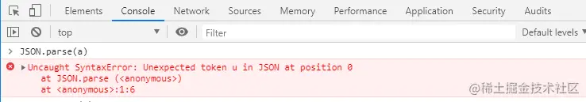
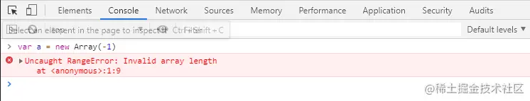
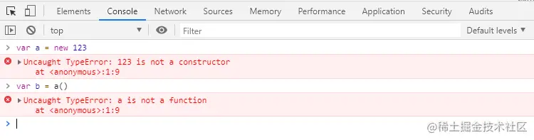
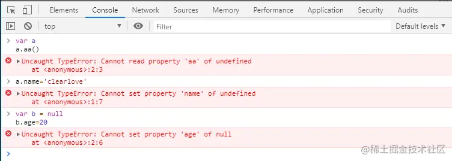
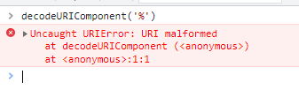
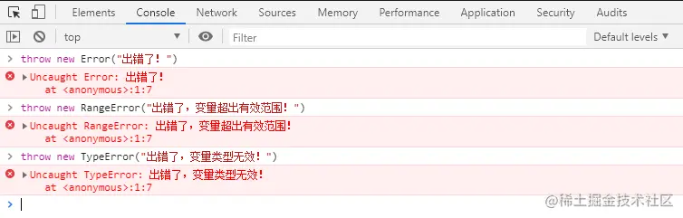

# 前端常见报错类型与解决方案

## 错误分类
- 代码错误
  + 这种错误浏览器会报错，可以根据具体的错误类型去排错
- 逻辑错误
  + 这种错误浏览器不会报错，但可以通过打印日志，或者打断点进行调色排错
  
## javascript中的七种错误类型

### SyntaxError 语法错误
报错为：Uncaught Syntaxerror: 相关信息提示。表示解析代码时发生的语法错误，即写的代码不符合js编码规则。
我们可以根据后面的提示信息去修改错误，当然，语法错误，浏览器会直接报错，整个代码都不会执行
如下：第一种变量名以数字开头，第二种缺少括号


### ReferenceError 引用错误
报错为 Uncaught ReferenceError：***。表示使用了没有定义的变量，错误之前的代码会执行，之后的代码不会执行
如下：第一种引用了不存在的变量，第二种将变量赋值给一个无法被赋值的对象，第三种使用JSON.parse解析不合法的字符串



### RangeError 范围错误
RangeError是当一个值超出有效范围时发生的错误。主要是1.数组长度为负数，2.number对象的方法参数超出范围，3.函数堆栈超过最大值


### TypeError 类型错误
- 变量或参数不是预期类型，比如字符串、布尔值、数值等原始类型的值使用new命令，因为new后面必须是一个构造函数


- 调用对象不存在的方法。


### URIError URL错误
URIError 是 URL相关函数的参数不正确时抛出的错误，主要涉及 encodeURI()、decodeURI()、encodeURIComponent()、decodeURIComponent()、
escape()和unescape() 这六个函数。这些API的使用较少，因此这种错误在日常开发中很少遇到


### EvalError (eval错误)
eval函数没有被正确执行时，会抛出 EvalError错误。该错误类型以及不再在ES5中出现了，只是为了保证与以前代码兼容，才继续保留。因此这种错误在我们日常开发中也基本不会遇到

### Error (基类型)
Error 是基类型，其他六种错误类型都继承自该类型。因此所有错误类型共享了一组相同的属性。Error类型的错误很少见，如果有也是浏览器抛出的；
这个基类型的主要目的是供开发人员抛出自定义错误


## 浏览器的其他报错情况
- XMLHttpRequest cannot load http://***. No 'Access-Control-Allow-Origin' header is present on the requested resource. Origin 'http://***' is therefore not allowed access.
> 进行异步请求时，产生跨域了
- Illegal break statement
> 出现了非法语句
- GET file:///****::ERR_FILE_NOT_FOUND
> 找不到引入的.js文件。可能原因：没有引入文件，或者js文件名字拼写错误（比如，少了文件后缀.）
- Failed to load resource: the server responded with a status of 404 (Not Found)
> 文件没有被找到，说明文件引用的路径有问题，或文件损坏

## 常用解决方案
我们在日常开发中，代码报错多是因为null和undefined造成的，所以在写代码的时候要考虑到一些特殊情况的处理，避免发生错误
```js
const obj = {
  name: 'nodon',
  info: {
    age: 18,
  }
}

if (obj.msg.age === 18) { // Uncaught TypeError: Cannot read properties of undefined (reading 'age')
  console.log('年龄18岁');
}
```
上述代码在取值的过程中便会报错，因为obj.msg是undefined，导致取值age属性的时候是不存在的，因此在我们开发过程中，需要保证在取值过程中需要对每一次取值的结果进行验证，只有每一次取值结果符合期望才可以执行取值操作
1. &&短路运算符进行可访问性嗅探：
`if(obj.msg && obj.msg.age === 18) {}`
2. || 单元设置默认保底值：
`if((obj.msg || {}).age === 18) {}`
3. try catch捕获异常：
```js
try {
  if (obj.msg.age === 18) {
    console.log('年龄18岁');
  }
} catch {
  // todo...
}
```
上述&& 和 || 两种种方式针对简单的数据结构是可以的，比较简单直观，二try catch的方式对代码的侵入性较高，不易过于频繁使用，而我们的取值操作是一件非常高频的事情，不可能每一次取值都要加try catch来进行容错处理
若是存在深层嵌套结构时：
```js
const obj = {
 user: {
  info: {
   hobbys: {
    sports: [
     {
      value: "basketball",
      label: "篮球",
     },
     {
      value: "football",
      label: "足球",
     },
    ],
   },
  },
 },
};
```
此时若是使用&& 和 || 的方式进行代码健壮性处理：
```js
if(
  obj &&
  obj.user &&
  obj.user.info &&
  obj.user.info.hobbys &&
  obj.user.info.hobbys.sports &&
  obj.user.info.hobbys.sports[1] &&
  obj.user.info.hobbys.sports[1].value === 'basketball'
) {
  // todo...
}
```
看着上述密密麻麻的判断，是不是心情顿时就不好了，因此&& 和 || 的方式将会使代码变得十分臃肿，不是很合适。
- 推荐使用 lodash 里的 _.get 方法进行取值
```js
var object = { 'a': [{ 'b': { 'c': 3 } }] };

_.get(object, 'a[0].b.c'); // 3

// 取不存在的值时不会报错默认返回 undefine，也可通过第三个参数设置缺省值
_.get(object, 'a.b.c', 'default'); // default
```
- 可选链操作符(?.)
```js
const obj = {
  foo： {
    bar： {
      baz: 43,
    }
  }
}

const baz = obj?.foo?.bar?.baz; // 43
const safe = obj?.qux?.baz; // undefined
```

> 延生阅读：深入前端错误/异常 https://juejin.cn/post/6844904138334011406